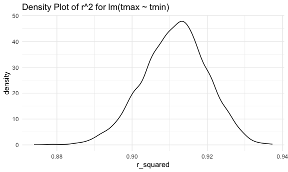
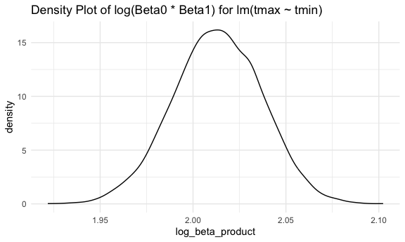
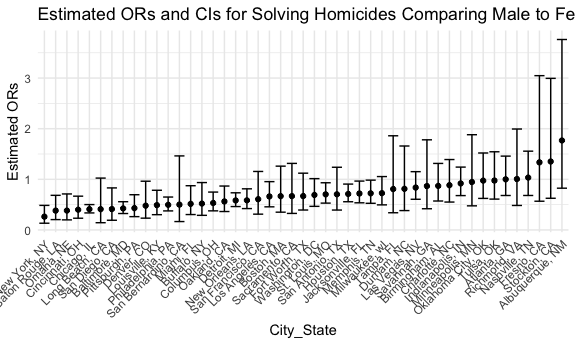

p8105_hw6_lr3257
================
Leonor Rui
2024-11-23

## Problem 1

``` r
boot_sample = function(df) {
  
  boot_df = sample_frac(df, replace = TRUE)
  
  return(boot_df)
}
```

``` r
boot_straps = 
  tibble(
    strap_number = 1:5000
  ) |>
  mutate(
    strap_sample = map(strap_number, \(i) boot_sample(df = weather_df)),
    models = map(strap_sample, \(df) lm(tmax ~ tmin, data = df)),
    results1 = map(models, broom::tidy),
    r_squared = map(models, \(model) broom::glance(model) |> select(r.squared))
  )

bootstrap_results = 
  boot_straps |>
  select(strap_number, results1, r_squared) |>
  unnest(c(results1, r_squared)) |>
  group_by(strap_number) |>
  summarise(
    beta0 = estimate[term == "(Intercept)"],
    beta1 = estimate[term == "tmin"],
    r_squared = first(r.squared)
  ) |>
  mutate(
    log_beta_product = log(beta0 * beta1))
```

``` r
bootstrap_results |>
  ggplot(aes(x = r_squared)) +
  geom_density() +
  labs(
    title = "Density Plot of r^2 for lm(tmax ~ tmin)"
  )
```



``` r
bootstrap_results |>
  ggplot(aes(x = log_beta_product)) +
  geom_density() +
  labs(
    title = "Density Plot of log(Beta0 * Beta1) for lm(tmax ~ tmin)"
  )
```



Both the distributions of the estimates for r^2 and the estimates for
log(Beta0 \* Beta1) are normally distributed. The distribution of r^2
estimates has a center around 0.915 and the distribution of log(Beta0 \*
Beta1) estimates has a center around 2.02, meaning that such estimates
occur the most often in all the models generated from the 5000 bootstrap
samples.

``` r
ci_r2 = bootstrap_results |>
  summarise(
    lower = quantile(r_squared, probs = 0.025),
    upper = quantile(r_squared, probs = 0.975)
  )

ci_beta_product =  bootstrap_results |>
  summarise(
    lower = quantile(log_beta_product, probs = 0.025),
    upper = quantile(log_beta_product, probs = 0.975)
  )

ci_r2
```

    ## # A tibble: 1 × 2
    ##   lower upper
    ##   <dbl> <dbl>
    ## 1 0.894 0.927

``` r
ci_beta_product
```

    ## # A tibble: 1 × 2
    ##   lower upper
    ##   <dbl> <dbl>
    ## 1  1.96  2.06

## Problem 2

Import dataset & data cleaning

``` r
homicide_df = read.csv("data/homicide-data.csv") |>
  filter(victim_age != "Unknown",
         victim_sex != "Unknown",
         victim_race %in% c("White", "Black")) |>
  mutate(
    city_state = paste(city, state, sep = ", "),
    solved = ifelse(disposition == "Closed by arrest", 1, 0),
    victim_age = as.numeric(victim_age)) |>
  filter(!city_state %in% c("Dallas, TX", "Phoenix, AZ", "Kansas City, MO", "Tulsa, AL"))
```

Baltimore, MD:

``` r
baltimore_df = homicide_df |>
  filter(city_state == "Baltimore, MD")

baltimore_results = glm(solved ~ victim_age + victim_sex + victim_race, 
                        data = baltimore_df, family = binomial)

baltimore_results |>
  broom::tidy()
```

    ## # A tibble: 4 × 5
    ##   term             estimate std.error statistic  p.value
    ##   <chr>               <dbl>     <dbl>     <dbl>    <dbl>
    ## 1 (Intercept)       0.310     0.171        1.81 7.04e- 2
    ## 2 victim_age       -0.00673   0.00332     -2.02 4.30e- 2
    ## 3 victim_sexMale   -0.854     0.138       -6.18 6.26e-10
    ## 4 victim_raceWhite  0.842     0.175        4.82 1.45e- 6

``` r
baltimore_results |>
  broom::tidy(conf.int = TRUE, exponentiate = TRUE) |>
  filter(term == "victim_sexMale") |>
  select(estimate, conf.low, conf.high)
```

    ## # A tibble: 1 × 3
    ##   estimate conf.low conf.high
    ##      <dbl>    <dbl>     <dbl>
    ## 1    0.426    0.324     0.558

All cities:

``` r
homicide_results = homicide_df |>
  group_by(city_state) |>
  nest() |>
  mutate(
    models = map(data, \(df) glm(solved ~ victim_age + victim_sex + victim_race, 
                                data = df, family = binomial)),
    results = map(models, \(x) broom::tidy(x, conf.int = TRUE, exponentiate = TRUE))
  ) |>
  unnest(results) |>
  filter(term == "victim_sexMale") |>
  select(city_state, term, estimate, conf.low, conf.high)

homicide_results
```

    ## # A tibble: 47 × 5
    ## # Groups:   city_state [47]
    ##    city_state      term           estimate conf.low conf.high
    ##    <chr>           <chr>             <dbl>    <dbl>     <dbl>
    ##  1 Albuquerque, NM victim_sexMale    1.77     0.825     3.76 
    ##  2 Atlanta, GA     victim_sexMale    1.00     0.680     1.46 
    ##  3 Baltimore, MD   victim_sexMale    0.426    0.324     0.558
    ##  4 Baton Rouge, LA victim_sexMale    0.381    0.204     0.684
    ##  5 Birmingham, AL  victim_sexMale    0.870    0.571     1.31 
    ##  6 Boston, MA      victim_sexMale    0.667    0.351     1.26 
    ##  7 Buffalo, NY     victim_sexMale    0.521    0.288     0.936
    ##  8 Charlotte, NC   victim_sexMale    0.884    0.551     1.39 
    ##  9 Chicago, IL     victim_sexMale    0.410    0.336     0.501
    ## 10 Cincinnati, OH  victim_sexMale    0.400    0.231     0.667
    ## # ℹ 37 more rows

Create a plot that shows the estimated ORs and CIs for each city.
Organize cities according to estimated OR, and comment on the plot.

``` r
homicide_results |>
  ggplot(aes(x = fct_reorder(city_state, estimate), y = estimate)) +
  geom_point() +
  geom_errorbar(aes(ymin = conf.low, ymax = conf.high)) +
  theme(axis.text.x = element_text(angle = 45, vjust = 1, hjust = 1)) +
  labs(
    title = "Estimated ORs and CIs for Solving Homicides Comparing Male to Female Victims",
    x = "City_State",
    y = "Estimated ORs"
  )
```



The plot tells us that, for most cities in the dataset, homicides with
male victims are less likely to be solved that those with female
victims, with the exceptions of Richmond, Nashville, Fresco, Stockton,
and Albuquerque. Out of all the cities, New York has the lowest
estimated OR for solving homicides comparing male to female victim, and
Albuquerque has the highest. This means that the odds of solving
homicides for male victims are 0.262 times as high as the odds for
female victims in New York, but 1.77 times as high as the odds for
female victims in Albuquerque.

## Problem 3
